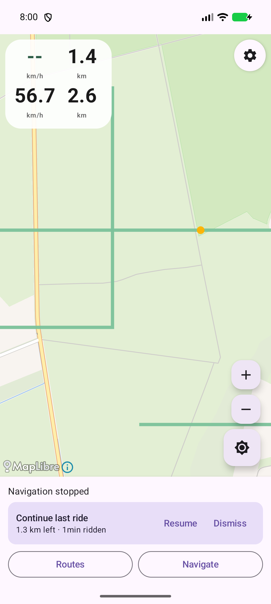
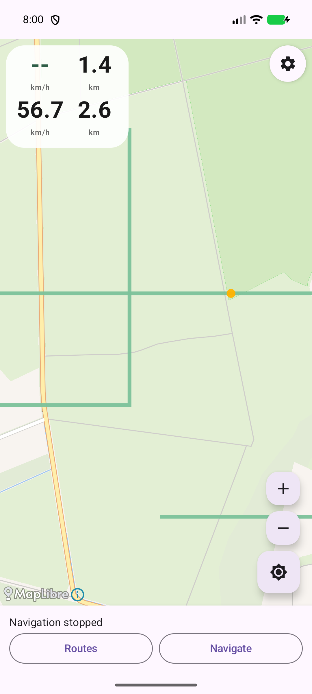

# Crazy Capy Randonneur

**Crazy Capy Randonneur** is an open source, voice-first GPS bike navigator for
Android. It focuses on:

- **Voice-first, battery-extreme** – spoken turn-by-turn guidance keeps working
  with the screen off. A partial wake lock and a foreground service power the
  GPS, the navigation engine and the TTS voice, while the display can sleep to
  save battery on OLED screens.
- **Your own routes** – import GPX (or TCX, KML, XML…) by sharing any file to
  the app, or from the in-app import picker. No accounts, no cloud, no route
  servers.
- **Turn-by-turn voice guidance** – speed-aware advance notices (e.g. “turn
  right in 500 meters” at ~50 s before the turn), a near-turn notice that also
  announces the following turn, periodic “go on for x.x km” heads-up, and
  off-route / back-on-route prompts.
- **Training HUD** – a compact top-left 3×2 grid with speed, distance covered,
  elapsed time, average speed, distance remaining and a tap-to-cycle ETA/time-left/
  total-time readout, plus a live preview of the route ahead around the next turn.
- **POI / waypoint head-up** – waypoints from your GPX are projected onto the
  route and announced as you approach.
- **Map** – MapLibre with free OpenFreeMap tile styles (dark by default to save
  OLED power), route polyline, heading arrow for your position, a “ghost ride”
  simulator to try navigation without leaving your home.
- **Saved routes library** – every route you import is stored on-device as GPX
  and listed with its length, so reloading a favourite is one tap. No accounts,
  no cloud.
- **Reverse direction** – ride any route in reverse, either from the start
  dialog or mid-ride with a single toggle.
- **Mid-route resume** – stop the ride and the app offers to keep going from
  exactly where you left off (also remembers it across restarts).
- **Turn preview** – a compact corner with a direction arrow and a real,
  zoomed, north-up map of the route ahead around each turn, built into the HUD
  (same style/tiles as the main map, rendered once per turn to save battery).
- **Pre-cache routes** – when a route is loaded the app offers to render
  all turn previews ahead of time (at home, on Wi-Fi, while charging) and warm
  the tile cache along the route corridor. Saves battery and network on the
  ride; the HUD pops up instantly from cached images, falling back to a live
  render when no cache exists.
- **Off-route ack** – when you stray, the app announces it and shows a chip
  you can tap to acknowledge; reminders stay quiet until you do.
- **Ghost ride controls** – live ×speed and target-speed buttons while
  ghosting, so you can race through a route or crawl to study it.
- **Distance phrasing** – spoken announcements rounded to 10 m granularity
  (e.g. "120 m" instead of "100 m"); HUD shows live exact meters for the
  first and last kilometre, 1‑decimal km beyond that.
- **Audio ducking** – guidance announcements pause other apps’ audio
  (like Google Maps), not the other way round; toggleable.
- **Turn beeps** – gentle left/right audio cues that shorten as the turn nears
  (relaxed pacing, never faster than every 2 s), with a volume slider (0 = off),
  separate from the spoken voice volume.
- **Battery-aware notifications** – the ride notification refreshes every
  second (great on the lock screen too) with next-turn guidance; turn it off
  (or the popup) in Settings to save battery.

> Required: Android **17 (API 37)**. This is deliberate – the project targets
> the newest platform only.

---

## Screenshots

Captured with the on-device ghost-ride simulator – no real riding needed. Light
and dark map styles are both shown.

| Ghost ride with HUD (light map, 3×2 grid) | Turn preview up close (light map) | Lock-screen notification |
| --- | --- | --- |
|  |  |  |

| Ghost ride with HUD (dark map, 3×2 grid) | Turn preview up close (dark map) | Settings (pre-cache toggle) |
| --- | --- | --- |
|  |  |  |

| Saved routes library (cache status) | Mid-ride resume offer | Route loaded on the map |
| --- | --- | --- |
|  |  |  |

Screenshot files are dated `YYYY-MM-DD-…` so stale captures are easy to spot.

---

## Getting started

### Prerequisites

- JDK 21 (the build sets `JAVA_HOME` below, or use any JDK 21+).
- Android SDK with platform **API 37** installed.
- (Optional) a physical Pixel/other phone for on-device testing; tests also run
  on the API 37 emulator image.

### Build

Set up environment and build debug APK:

```bash
# pick a JDK 21 (adjust path to your installation)
export JAVA_HOME=$HOME/.local/opt/jdk-21.0.12+8
export PATH=$PATH:$HOME/Android/Sdk/platform-tools

./gradlew :app:assembleDebug
```

Output: `app/build/outputs/apk/debug/app-debug.apk`

Install on a connected device/emulator:

```bash
adb install -r app/build/outputs/apk/debug/app-debug.apk
```

### Run

1. Launch **Crazy Capy Randonneur**.
2. Grant **location** permission (needed for GPS navigation and to place your
   arrow on the map).
3. Import a route: share a `.gpx`/`.tcx`/`.kml` file with the app, or tap
   **Import**. You should see the route line on the map. Later reloads are one
   tap under **Routes** (your saved library).
4. Tap **Navigate** to start real GPS navigation, or use **Settings → Ghost
   ride** to simulate riding the route so you can hear the voice guidance
   without moving. In the start dialog you can flip **Reverse direction** to
   ride it backwards.

While ghosting, use **Slower/Faster** and the **Slow/28 km/h/Fast** speed
buttons to tune the pace, hit **Reverse dir** to turn around mid-ride, and
**Stop** to finish. Stop anywhere and a banner offers to **Resume** the ride
from where you stopped.

Voice guidance needs the device TTS engine (usually installed by default).

---

## Testing

### 1. Unit tests (JVM, fast)

```bash
export JAVA_HOME=$HOME/.local/opt/jdk-21.0.12+8
./gradlew :app:testDebugUnitTest
```

Covers the pure-Kotlin core: GPX/TCX parsing, track math, turn detection,
guidance engine (advance notices, near-turn, go-straight, off/back-on-route,
arrival), phrase generation and the route simulator. No device needed.

### 2. Instrumented tests (device/emulator)

```bash
export JAVA_HOME=$HOME/.local/opt/jdk-21.0.12+8
./gradlew :app:connectedDebugAndroidTest
```

Runs on **every attached device/emulator** (physical phone + AVD if both are
connected). Includes the **ghost ride** tests
(`app/src/androidTest/.../GhostRideTest.kt`): a forward full-ride from the GPX
start, a **reversed** full-ride back to the original start, and a ride that
**resumes mid-route** via `seedAlong` rather than from the start. Each feeds
the synthetic fixes ~90× faster than real-time through the `NavigationService`
fix pipeline and asserts arrival with turn announcements.

> The ghost ride is headless – it feeds fixes straight into the engine and
> voices, it does **not** pop up the map UI. To *see* the map while ghosting,
> use the app’s **Ghost** button instead.

### 3. Manual / on-device

- **Real ride:** import a route, hit **Navigate**, ride. With the screen on you
  see your position arrow + track; put the display to sleep and voice keeps
  guiding.
- **Ghost ride**: from **Settings → Ghost ride** – the map follows the fast
  simulated rider so you can watch the heading arrow move, and the camera only
  recentres when you drift ~30% from the screen centre. Speed it up/down, flip
  direction, or resume a stopped ride from the banner.
- **Settings**: the gear icon (top-right) opens ride options: toggle the
  next-turn popup, the per-second notification (battery savers) and audio
  ducking; set the **turn-beep** and **navigation-voice** volumes (0 = off);
  toggle the **pre-cache** prompt; clear all route caches; manage your saved
  routes; start a **ghost ride**; and reach the app-version/about section plus
  the **Open-source licenses** viewer.

### 4. Golden screenshot verification (hacker option)

The map uses MapLibre+OpenFreeMap; with the debug apk installed you can verify
rendering via `adb exec-out screencap` and pixel analysis (see
`PLAN.md` for the technique).

---

## Project layout

| Path | What it is |
| --- | --- |
| `app/src/main/java/.../gpx` | GPX/TCX/KML loading, track/waypoint model, GPX writer (`GpxWriter`) for the saved-routes library |
| `app/src/main/java/.../nav` | Guidance core: `NavEngine`, `TurnFinder`, `PoiTracker`, `Geo` (pure Kotlin, unit-tested) |
| `app/src/main/java/.../voice` | Spoken phrases |
| `app/src/main/java/.../service` | Foreground `NavigationService`: GPS, ghost-ride driver, TTS (audio-focus ducking), wake lock, living notification |
| `app/src/main/java/.../state` | `RideStore` (shared app state), `RouteStore` (on-device route library + settings/last-ride persistence), `RideMode` |
| `app/src/main/java/.../ble` | BLE heart-rate provider (stub by default) |
| `app/src/main/java/.../cache` | Pre-cache: turn-image generation, storage, corridor tile warm, anchor projection |
| `app/src/main/java/.../sim` | Ghost ride simulator |
| `app/src/main/java/.../ui` | Compose overlays: HUD + next-turn preview, off-route ack, dialogs |
| `app/src/androidTest` | Instrumented ghost-ride test + assets |
| `PLAN.md` | Live development plan / status |

---

## Tech stack & data

- **Language/UI:** Kotlin, Jetpack Compose (Material 3).
- **Maps:** MapLibre Android SDK (BSD-2-Clause), tiles by
  **OpenFreeMap** (MIT / [ODbL](https://opendatacommons.org/licenses/odbl/)
  map data © [OpenStreetMap](https://www.openstreetmap.org/) contributors),
  attribution shown automatically by MapLibre.
- **Parsing:** kXML2 for XML routes.
- **CI-lite:** Gradle 8.13, AGP 8.13, Kotlin 2.1.21.

---

## License & third-party notices

- **This project** is licensed under the **Apache License 2.0** – see
  [LICENSE](LICENSE). Every source file carries an SPDX header
  (`SPDX-License-Identifier: Apache-2.0`).
- **Third-party components** (MapLibre, OpenFreeMap/OSM, AndroidX, Compose,
  Kotlin, kXML, Gradle, AGP, JUnit, …) and their licenses are listed in
  [THIRD_PARTY_NOTICES.md](THIRD_PARTY_NOTICES.md). The same file is bundled
  into the app (`assets/notices/`) and readable at
  **Settings → Open-source licenses** at any time.

Attribution requirement: the app keeps MapLibre’s attribution control visible
(“OpenFreeMap © OpenMapTiles, Data from OpenStreetMap”), as required by the
OpenFreeMap / OSM terms; do not hide it in modified builds.

---

## Status

See [PLAN.md](PLAN.md) for the live milestone list and “next move” notes.