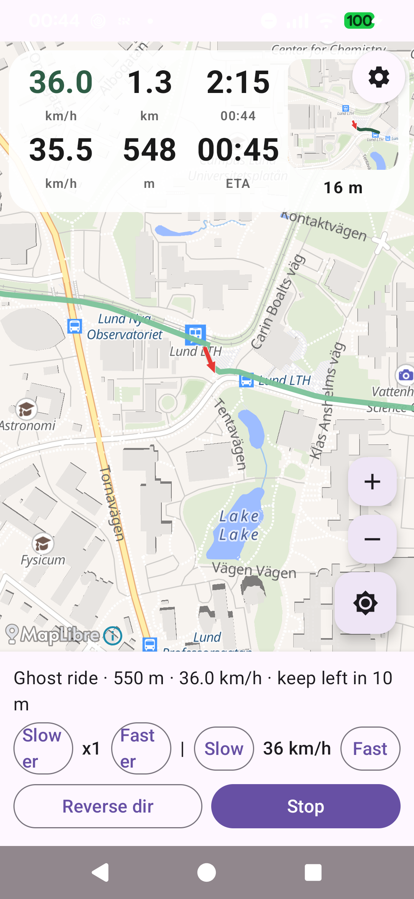
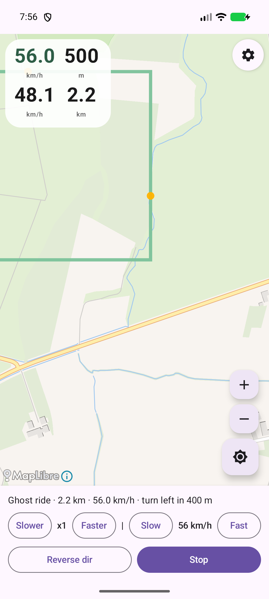
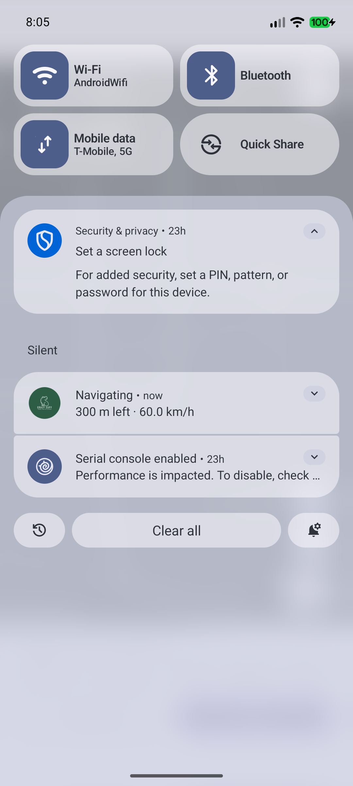
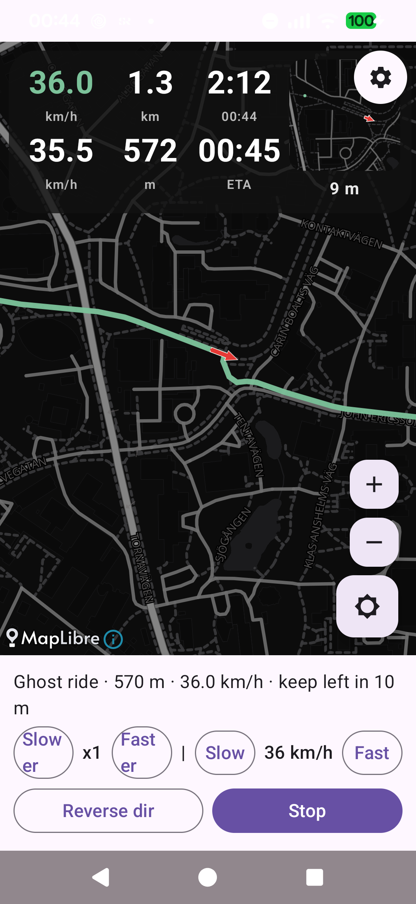
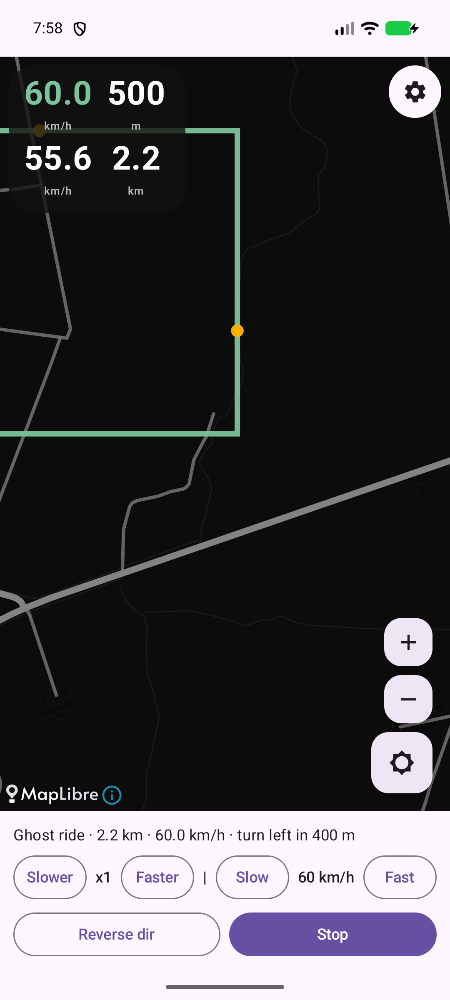
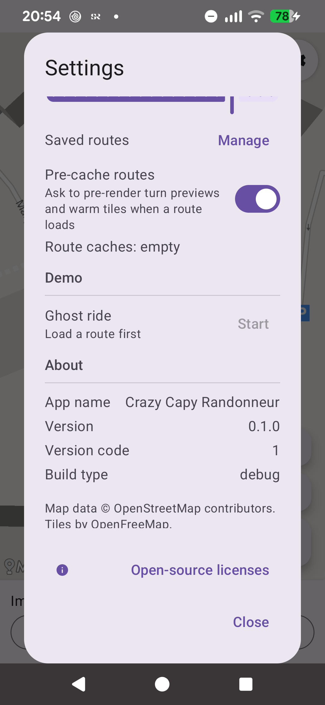
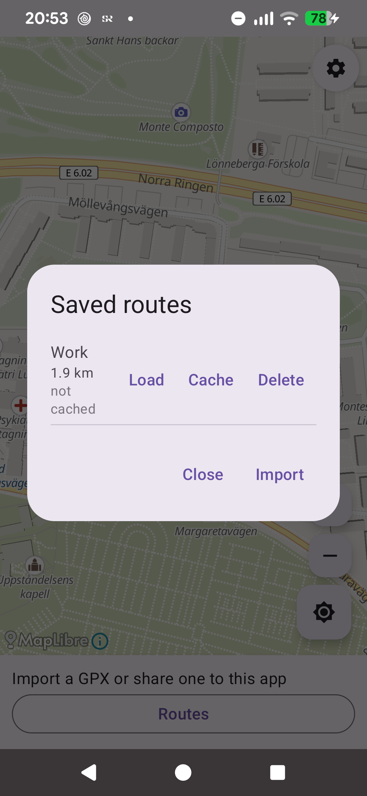
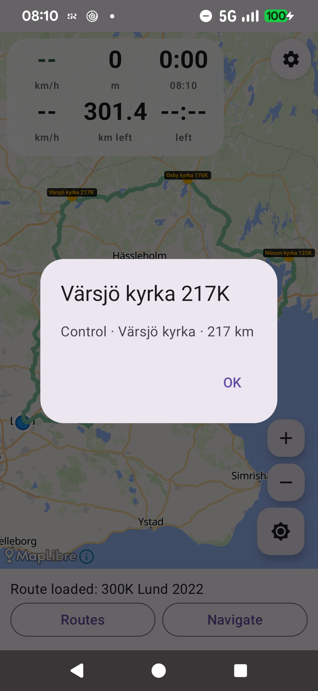
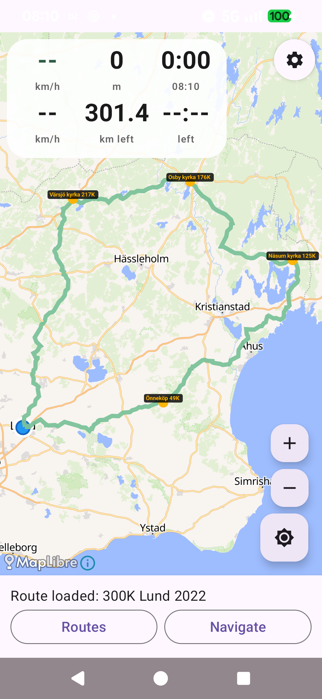

# Crazy Capy Randonneur

**Ride all day on one charge.** Crazy Capy Randonneur is an open-source,
voice-first bike GPS for Android that treats battery life as a first-class
feature. You load your own GPX route, slip the phone in your pocket, and let
your ears do the navigating — no accounts, no cloud, no ads.

> Required: Android **17 (API 37)** — the project deliberately targets the
> newest platform only.

## Why it preserve battery

- **Screen off while riding** – guidance is voice-first. A foreground service
  and a light wake lock keep GPS, navigation and speech running while the
  display sleeps — the single biggest win on an OLED phone.
- **Gentle GPS cadence** – a steady 3-second fix interval (no Play Services
  fused location, no cloud round-trips) is plenty for turn-by-turn guidance.
- **Pre-cached turn previews** – the app offers to render every turn preview and
  warm the map tiles along the route *before* you leave (on Wi-Fi, at home).
  On the ride the HUD pops up instantly from those cached images with zero tile
  fetches — and no/less live rendering, so your radio stays quieter. If it gets
  interrupted it reports how many turns were cached ("Pre-cached 34/347
  · rest on next load") and resumes on the next load, skipping what's done.
- **Dark OLED map by default** – the dark tile style is the default; light is
  one tap away.
- **Toggleable extras** – the per-second live notification and the corner popup
  can each be switched off in Settings when you don't need them.

## Highlights

- **Voice turn-by-turn** – speed-aware advance notices ("turn right in 500
  meters" ~50 s before the turn), a near-turn notice that also names the
  following turn, periodic "go on for x.x km" heads-up, and off-route /
  back-on-route prompts.
- **Turn beeps, too** – not many navigators do this: alongside the voice,
  gentle left/right beeps cue the next turn, quickening as it nears (never
  faster than every 2 s). Separate volume sliders for beeps and voice.
- **Your own routes** – import GPX, TCX, KML… by sharing a file to the app or
  via the in-app picker. Routes are stored on-device in a one-tap library; ride
  any of them in reverse.
- **RWGPS import** – paste a ridewithgps.com route URL/id or a user profile
  URL/id to import the route and its brevet controls. Reads the route's public
  JSON (POIs become checkpoints), so no account or premium needed.
- **Training HUD** – a compact top-left 3×2 grid with speed, distance covered,
  elapsed time, average speed, distance left (switches to distance-to-next
  checkpoint while riding, e.g. `12.4 km CP 3`) and a tap-to-cycle ETA /
  time-left / total-time / ETA-CPx readout, beside a live preview of the route
  ahead at the next turn.
- **Waypoint head-up** – POIs baked into your GPX are projected onto the route
  and announced as you approach. Named checkpoints are drawn on the map; tap one
  to read its description.
- **Mid-route resume** – stop the ride and the app offers to continue exactly
  where you left off, even across restarts.
- **Audio ducking** – guidance pauses other apps' audio (like Google Maps),
  not the other way round.
- **Living lock-screen notification** – refreshes every second with next-turn
  guidance while your screen is off.
- **Live rear-radar (optional)** – when the separate
  [android-bike-radar-overlay](https://github.com/partymola/android-bike-radar-overlay)
  app is installed and permitted, Crazy Capy consumes its rear-radar stream
  and draws real overtaking traffic on the map during GPS rides, plus a radar
  battery chip and a tail-light toggle. Nothing is used when the overlay app
  is absent.

### Testing
- **Ghost ride simulator** – try any route without leaving home: follow a
  simulated rider on the map, hear the full guidance, and control the pace.
- **Simulated rear-radar traffic** – on a ghost ride, cars, trucks and bikes
  overtake from behind (coloured dots on the map, disappearing once they pass,
  since a rear radar only looks back). Toggle it in the ghost-ride start
  dialog.

---

## Screenshots

Captured with the on-device ghost-ride simulator – no real riding needed. Light
and dark map styles are both shown.

| Ghost ride with HUD (light map, 3×2 grid) | Turn preview up close (light map) | Lock-screen notification |
| --- | --- | --- |
|  |  |  |

| Ghost ride with HUD (dark map, 3×2 grid) | Turn preview up close (dark map) | Settings (pre-cache toggle) |
| --- | --- | --- |
|  |  |  |

| Saved routes library (cache status) | Checkpoint info popup (phone) | Route loaded with checkpoint markers (phone) |
| --- | --- | --- |
|  |  |  |

---

## Getting started

### Prerequisites

- JDK 21 (the build sets `JAVA_HOME` below, or use any JDK 21+).
- Android SDK with platform **API 37** installed.
- (Optional) a physical Pixel/other phone for on-device testing; tests also run
  on the API 37 emulator image.

### Build

Set up environment and build debug APK:

```bash
# pick a JDK 21 (adjust path to your installation)
export JAVA_HOME=$HOME/.local/opt/jdk-21.0.12+8
export PATH=$PATH:$HOME/Android/Sdk/platform-tools

./gradlew :app:assembleDebug
```

Output: `app/build/outputs/apk/debug/app-debug.apk`

Install on a connected device/emulator:

```bash
adb install -r app/build/outputs/apk/debug/app-debug.apk
```

#### Flash to your phone

Copy-paste build + install to the phone over USB (`adb -d` targets the single
USB-connected device; see `adb devices` — a phone may show as `unauthorized`
until you accept the debug prompt on it):

```bash
export JAVA_HOME=$HOME/.local/opt/jdk-21.0.12+8
export PATH=$PATH:$HOME/Android/Sdk/platform-tools

./gradlew :app:assembleDebug
adb -d install -r app/build/outputs/apk/debug/app-debug.apk
```

Never skip the `assembleDebug` — the APK under
`app/build/outputs/apk/debug/` can be stale from an earlier build.

### Run

1. Launch **Crazy Capy Randonneur**.
2. Grant **location** permission (needed for GPS navigation and to place your
   arrow on the map).
3. Import a route: share a `.gpx`/`.tcx`/`.kml` file with the app, or tap
   **Import**. You should see the route line on the map. Later reloads are one
   tap under **Routes** (your saved library).
4. Tap **Navigate** to start real GPS navigation, or use **Settings → Ghost
   ride** to simulate riding the route so you can hear the voice guidance
   without moving. In the start dialog you can flip **Reverse direction** to
   ride it backwards.

While ghosting, use **Slower/Faster** and the **Slow/28 km/h/Fast** speed
buttons to tune the pace, hit **Reverse dir** to turn around mid-ride, and
**Stop** to finish. Stop anywhere and a banner offers to **Resume** the ride
from where you stopped.

Voice guidance needs the device TTS engine (usually installed by default).

---

## Testing

### 1. Unit tests (JVM, fast)

```bash
export JAVA_HOME=$HOME/.local/opt/jdk-21.0.12+8
./gradlew :app:testDebugUnitTest
```

Covers the pure-Kotlin core: GPX/TCX/KML parsing, track math, turn detection,
guidance engine (advance notices, near-turn, go-straight, off/back-on-route,
arrival), phrase generation and the route simulator. No device needed.

### 2. Instrumented tests (device/emulator)

```bash
export JAVA_HOME=$HOME/.local/opt/jdk-21.0.12+8
./gradlew :app:connectedDebugAndroidTest
```

Runs on **every attached device/emulator** (physical phone + AVD if both are
connected). Includes the **ghost ride** tests
(`app/src/androidTest/.../GhostRideTest.kt`): a forward full-ride from the GPX
start, a **reversed** full-ride back to the original start, and a ride that
**resumes mid-route** via `seedAlong` rather than from the start. Each feeds
the synthetic fixes ~90× faster than real-time through the `NavigationService`
fix pipeline and asserts arrival with turn announcements.

> The ghost ride is headless – it feeds fixes straight into the engine and
> voices, it does **not** pop up the map UI. To *see* the map while ghosting,
> use the app’s **Ghost** button instead.

### 3. Manual / on-device

- **Real ride:** import a route, hit **Navigate**, ride. With the screen on you
  see your position arrow + track; put the display to sleep and voice keeps
  guiding.
- **Ghost ride**: from **Settings → Ghost ride** – the map follows the fast
  simulated rider so you can watch the heading arrow move, and the camera only
  recentres when you drift ~30% from the screen centre. Speed it up/down, flip
  direction, or resume a stopped ride from the banner.
- **Settings**: the gear icon (top-right) opens ride options: toggle the
  next-turn popup, the per-second notification (battery savers) and audio
  ducking; set the **turn-beep** and **navigation-voice** volumes (0 = off);
  toggle the **pre-cache** prompt; clear all route caches; manage your saved
  routes; start a **ghost ride**; and reach the app-version/about section plus
  the **Open-source licenses** viewer.

### 4. Golden screenshot verification (hacker option)

The map uses MapLibre+OpenFreeMap; with the debug apk installed you can verify
rendering via `adb exec-out screencap` and pixel analysis (see
`PLAN.md` for the technique).

---

## Project layout

| Path | What it is |
| --- | --- |
| `app/src/main/java/.../gpx` | GPX/TCX/KML loading, track/waypoint model, GPX writer (`GpxWriter`) for the saved-routes library |
| `app/src/main/java/.../nav` | Guidance core: `NavEngine`, `TurnFinder`, `PoiTracker`, `Geo` (pure Kotlin, unit-tested) |
| `app/src/main/java/.../voice` | Spoken phrases |
| `app/src/main/java/.../service` | Foreground `NavigationService`: GPS, ghost-ride driver, TTS (audio-focus ducking), wake lock, living notification |
| `app/src/main/java/.../state` | `RideStore` (shared app state), `RouteStore` (on-device route library + settings/last-ride persistence), `RideMode` |
| `app/src/main/java/.../ble` | BLE heart-rate provider (stub by default) |
| `app/src/main/java/.../cache` | Pre-cache: turn-image generation, storage, corridor tile warm, anchor projection |
| `app/src/main/java/.../sim` | Ghost ride simulator |
| `app/src/main/java/.../ui` | Compose overlays: HUD + next-turn preview, off-route ack, dialogs |
| `app/src/androidTest` | Instrumented ghost-ride test + assets |
| `PLAN.md` | Live development plan / status |

---

## Tech stack & data

- **Language/UI:** Kotlin, Jetpack Compose (Material 3).
- **Maps:** MapLibre Android SDK (BSD-2-Clause), tiles by
  **OpenFreeMap** (MIT / [ODbL](https://opendatacommons.org/licenses/odbl/)
  map data © [OpenStreetMap](https://www.openstreetmap.org/) contributors),
  attribution shown automatically by MapLibre.
- **Parsing:** kXML2 for XML routes.
- **CI-lite:** Gradle 8.13, AGP 8.13, Kotlin 2.1.21.

---

## Codebase

- **Cross-app interface files** (`app/src/main/aidl/.../radar/`): the AIDL
  contract shared with the optional
  [android-bike-radar-overlay](https://github.com/partymola/android-bike-radar-overlay)
  app is dual-licensed **`Apache-2.0 OR 0BSD`** (`SPDX-License-Identifier:
  Apache-2.0 OR 0BSD`).

---

## License & third-party notices

- **This project** is licensed under the **Apache License 2.0** – see
  [LICENSE](LICENSE). Every source file carries an SPDX header
  (`SPDX-License-Identifier: Apache-2.0`).
- **Cross-app radar contract** (`app/src/main/aidl/.../radar/`): the AIDL
  interface shared with the optional overlay app is **dual-licensed**
  `Apache-2.0 OR 0BSD`. The wire-format field layout (UUIDs, mode type bytes,
  parcel field order) is factual interface data; this pick-either dual license
  is a deliberate choice so the same interface is easy to use and share across
  projects — CrazyCapy uses the Apache-2.0 option, while a GPL-2/3 project can
  take the 0BSD option. Both options are Apache- and GPL-2/3-compatible. The
  Parcelable and binder implementations remain separate per-repo app code.
- **Third-party components** (MapLibre, OpenFreeMap/OSM, AndroidX, Compose,
  Kotlin, kXML, Gradle, AGP, JUnit, …) and their licenses are listed in
  [THIRD_PARTY_NOTICES.md](THIRD_PARTY_NOTICES.md). The same file is bundled
  into the app (`assets/notices/`) and readable at
  **Settings → Open-source licenses** at any time.
- **Optional overlay app** ([android-bike-radar-overlay](https://github.com/partymola/android-bike-radar-overlay))
  is **GPL-3.0-or-later**, whereas Crazy Capy is **Apache-2.0**; these are not
  link-compatible. The two apps stay separate APKs and communicate over the
  Android binder with no shared code, and no GPL code is imported into this APK.

Attribution requirement: the app keeps MapLibre’s attribution control visible
(“OpenFreeMap © OpenMapTiles, Data from OpenStreetMap”), as required by the
OpenFreeMap / OSM terms; do not hide it in modified builds.

---

## Status

See [PLAN.md](PLAN.md) for the live milestone list and “next move” notes.
